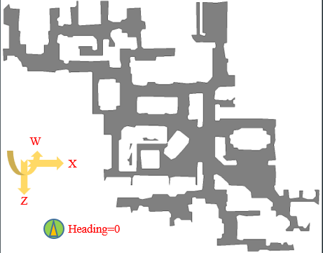
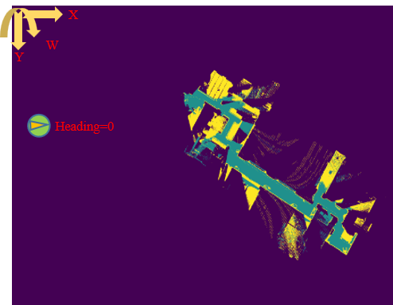
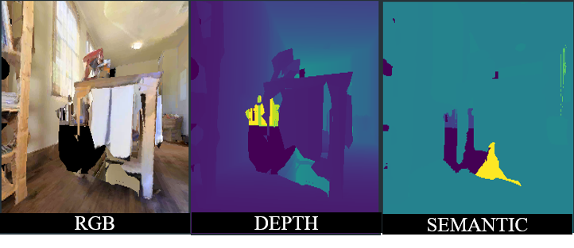
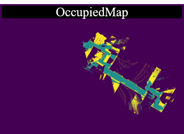
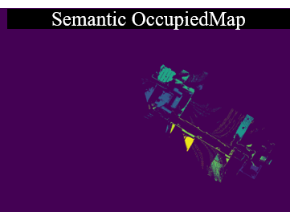
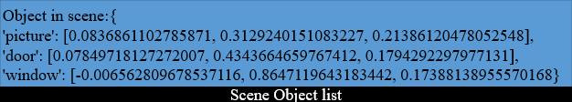

# Introduction 
A library of various mapping function for habitat<https://github.com/HongyanZhi/Habitat-Mapping-Implement.git> platform

## Map Coordinate System
TopDownMap Coordinate System : The coordinate center maybe locates somewhere in the world
  
OccupiedMap Coordinate System  : The coordinate center locates on the left-top of the image
  

## Application Overview
### Input : RGB,DEPTH,SEMANTIC

### Output:     
OccupiedMap : project the depth image into the top down map    
  
SemanticOccupiedMap : project the semantic image into the top down map which each pixels has some semantic meanings  
    
SceneObjectList : Object average coordinate based on current observation 
        

# Notation
1. Depth image as input must be in the scale of 10 meters, which is the default setting of DEPEH_SENSOR
2. Please carefully check if the semantic images corresponding to the rgb images
3. This library is suitable both for discrete and continuous enviroment; Please update the agent location by position in discrete environment and update the agent location by position or action in  continuous environment 

# Example
Please run the demo functions in example.py and view the reference visualization in folder visualization. Example test on **v0.2.1** both for habitat-lab and habitat-sim

# API
